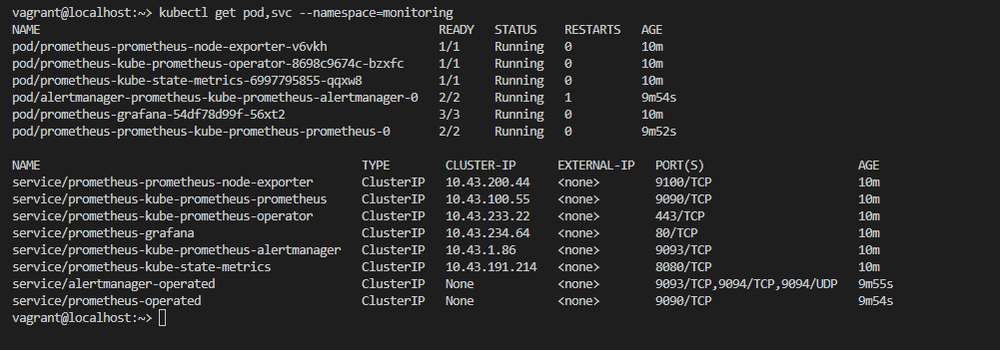
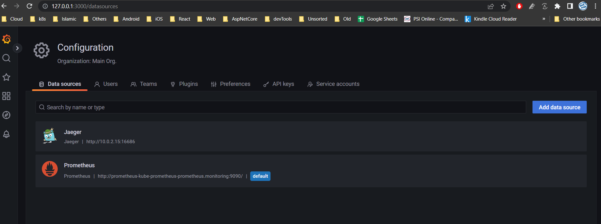
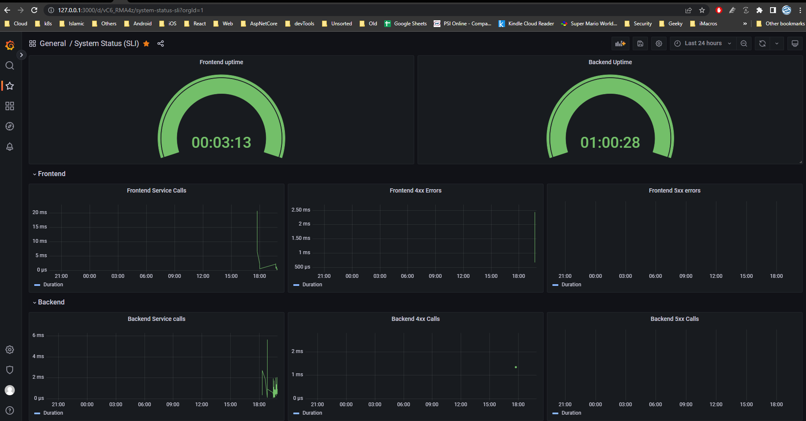
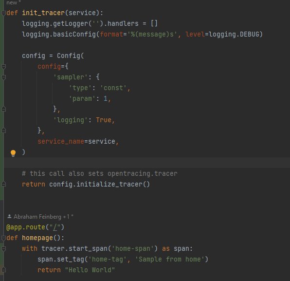

**Note:** For the screenshots, you can store all of your answer images in the `answer-img` directory.

## Verify the monitoring installation

*TODO:* run `kubectl` command to show the running pods and services for all components. Take a screenshot of the output and include it here to verify the installation

## Setup the Jaeger and Prometheus source
*TODO:* Expose Grafana to the internet and then setup Prometheus as a data source. Provide a screenshot of the home page after logging into Grafana.

## Create a Basic Dashboard
*TODO:* Create a dashboard in Grafana that shows Prometheus as a source. Take a screenshot and include it here.

## Describe SLO/SLI
*TODO:* Describe, in your own words, what the SLIs are, based on an SLO of *monthly uptime* and *request response time*.
### System SLO
> Definition 
a measurable goal set by the SRE team to ensure a standard level of performance during a specified period of time
- Uptime SLO
    - 99.95% monthly uptime
- Latency SLO
    - 200 ms Request response time
### System SLIs
> Definition
a specific metric used to measure the performance of a service.
- Monthly uptime SLA
    - System should fail for 0.05% requests per month ex:
    - For all 100,000 Request accepted Error budget for fail request is 5000 requests
- Request response time SLA
    - System request's response average should be less than or equal 200 ms

## Creating SLI metrics.
*TODO:* It is important to know why we want to measure certain metrics for our customer. Describe in detail 5 metrics to measure these SLIs. 
- Overall requests counts for apps(Front-end and back-end)
- Failed requests (4xx and 5xx) counts for apps(front-end and back-end)
- Failed requests (4xx and 5xx) percentage to successful per month
- Average request response time per month 
- CPU Utilization per nodes/pods

## Create a Dashboard to measure our SLIs
*TODO:* Create a dashboard to measure the uptime of the frontend and backend services We will also want to measure to measure 40x and 50x errors. Create a dashboard that show these values over a 24 hour period and take a screenshot.

## Tracing our Flask App
*TODO:*  We will create a Jaeger span to measure the processes on the backend. Once you fill in the span, provide a screenshot of it here. Also provide a (screenshot) sample Python file containing a trace and span code used to perform Jaeger traces on the backend service.

## Jaeger in Dashboards
*TODO:* Now that the trace is running, let's add the metric to our current Grafana dashboard. Once this is completed, provide a screenshot of it here.

## Report Error
*TODO:* Using the template below, write a trouble ticket for the developers, to explain the errors that you are seeing (400, 500, latency) and to let them know the file that is causing the issue also include a screenshot of the tracer span to demonstrate how we can user a tracer to locate errors easily.

TROUBLE TICKET

Name: Mustafa Saad

Date: 03-01-2023

Subject: Backend 4xx Errors

Affected Area: Backend application uptime SLO

Severity: High

Description: We see increasing in 4xx errors in backend application which if continue can affect our SLO of 99.95 Uptime

## Creating SLIs and SLOs
*TODO:* We want to create an SLO guaranteeing that our application has a 99.95% uptime per month. Name four SLIs that you would use to measure the success of this SLO.
- Uptime
- 4xx and 5xx Errors rate

## Building KPIs for our plan
*TODO*: Now that we have our SLIs and SLOs, create a list of 2-3 KPIs to accurately measure these metrics as well as a description of why those KPIs were chosen. We will make a dashboard for this, but first write them down here.
- Applications service(s) Uptime
- 4xx and 5xx Error rate to 2xx success rate
- Request's response latency

## Final Dashboard
*TODO*: Create a Dashboard containing graphs that capture all the metrics of your KPIs and adequately representing your SLIs and SLOs. Include a screenshot of the dashboard here, and write a text description of what graphs are represented in the dashboard.  
